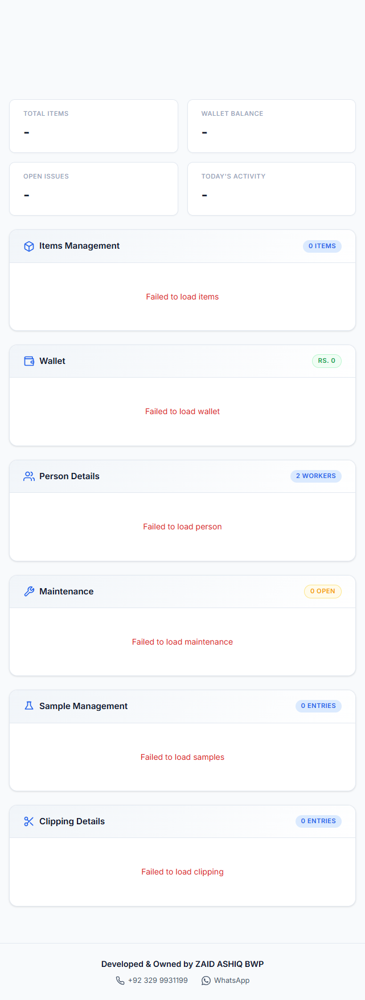
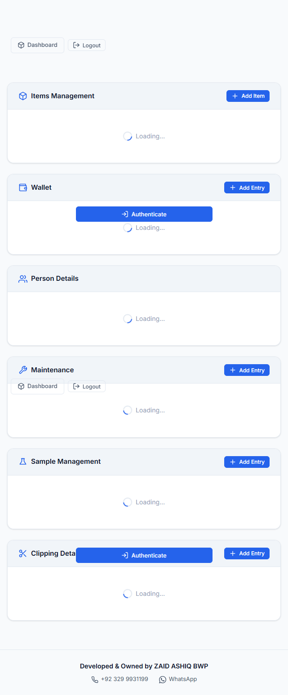

# ZAID BWP Stock Manager

A comprehensive stock management system with WhatsApp integration, built for Vercel serverless deployment.



## Features

### 📦 Stock Management
- **Items** - Track inventory with serial numbers, models, and status
- **Wallet** - Manage financial transactions
- **Persons** - Customer/client database
- **Maintenance** - Equipment maintenance tracking
- **Samples** - Sample inventory management
- **Clipping** - Clipping records

### 💬 WhatsApp Integration
- **Pairing Code Authentication** - Link WhatsApp account via pairing code (more reliable than QR)
- **Instant Notifications** - Formatted messages sent to +92 324 4643714 and +92 371 1286436 when entries are added
- **SMS Commands** - Text commands to receive Excel files or image summaries:
  - `itemsms` / `itemspic` - Items data
  - `walletms` / `walletpic` - Wallet data
  - `personms` / `personpic` - Person data
  - `maintenancems` / `maintenancepic` - Maintenance data
  - `samplesms` / `samplespic` - Samples data
  - `clippingms` / `clippingpic` - Clipping data

### 🎨 Modern UI/UX
- Dark/Light theme support
- Responsive design for mobile and desktop
- PWA support with offline capabilities
- Push notifications
- Animated backgrounds and smooth transitions
- Real-time stats dashboard

### 🔒 Security
- GitHub-based authentication
- Session management via environment variables
- Secure API endpoints

## Tech Stack

- **Frontend**: HTML5, CSS3, Vanilla JavaScript
- **Backend**: Node.js serverless functions (Vercel)
- **Database**: GitHub repository (JSON storage)
- **WhatsApp**: Baileys library
- **Deployment**: Vercel

## Project Structure

```
/workspace
├── api/                      # Serverless functions
│   ├── _auth-middleware.js   # Authentication middleware
│   ├── _github.js            # GitHub API utilities
│   ├── _notify-helper.js     # Notification helpers
│   ├── _whatsapp-session.js  # WhatsApp session management
│   ├── auth.js               # Auth endpoint
│   ├── subscribe.js          # Push notification subscription
│   ├── notify.js             # Notification endpoint
│   ├── whatsapp.js           # WhatsApp pairing endpoint
│   ├── whatsapp-send.js      # Send WhatsApp messages
│   ├── whatsapp-webhook.js   # Incoming message handler
│   └── data/                 # CRUD endpoints for each section
├── components/               # UI components
├── css/                      # Stylesheets
│   ├── style.css             # Main styles
│   ├── dashboard.css         # Dashboard styles
│   └── hub.css               # Hub styles
├── js/                       # JavaScript modules
├── icons/                    # App icons
├── data/                     # Local data storage
├── index.html                # Main application page
├── admin.html                # Admin panel
├── section.html              # Section template
├── manifest.json             # PWA manifest
├── sw.js                     # Service worker
├── vercel.json               # Vercel configuration
└── package.json              # Dependencies
```

## Quick Start

### Prerequisites
- Node.js >= 18
- Git
- GitHub account
- Vercel account
- WhatsApp account (for notifications)

### Installation

1. **Clone the repository**
```bash
git clone https://github.com/YOUR_USERNAME/stock-manager.git
cd stock-manager
```

2. **Install dependencies**
```bash
npm install
```

3. **Configure environment variables**

Create a `.env` file or add these in Vercel dashboard:

```bash
# Required
GITHUB_TOKEN=your_github_personal_access_token
GITHUB_REPO=your_username/stock-manager
GITHUB_BRANCH=main

# WhatsApp (after pairing)
WA_SESSION_ID=zaidashiq_923xxxxxxxxx

# Push Notifications (optional)
VAPID_PUBLIC_KEY=your_vapid_public_key
VAPID_PRIVATE_KEY=your_vapid_private_key
VAPID_EMAIL=your_email@example.com
```

4. **Deploy to Vercel**
```bash
# Install Vercel CLI
npm i -g vercel

# Deploy
vercel
```

## WhatsApp Setup

### Step 1: Deploy to Vercel
Deploy your project first with `GITHUB_TOKEN`, `GITHUB_REPO`, and `GITHUB_BRANCH` environment variables.

### Step 2: Link WhatsApp
1. Open your deployed admin panel (`admin.html`)
2. Click the **WhatsApp** button in the header
3. Enter your phone number with country code (e.g., `923244643714`)
4. Click **Get Pairing Code**
5. Wait ~30 seconds for the code to appear (format: `XXXX-XXXX`)
6. On your phone:
   - Open WhatsApp → Settings → Linked Devices
   - Tap "Link a Device"
   - Choose **"Link with Phone Number"** (at bottom)
   - Enter the pairing code
7. You'll receive a Session ID on WhatsApp (starts with `zaidashiq_`)

### Step 3: Configure Session
1. Copy the Session ID you received
2. Add it as `WA_SESSION_ID` environment variable in Vercel dashboard
3. Redeploy your project

### Step 4: Test
1. Add a new entry in any section
2. Both configured numbers should receive a formatted notification
3. Text `itemsms` from your linked number to test command responses

## Environment Variables

| Variable | Description | Required |
|----------|-------------|----------|
| `GITHUB_TOKEN` | GitHub personal access token (repo scope) | ✅ |
| `GITHUB_REPO` | Your GitHub username/repo | ✅ |
| `GITHUB_BRANCH` | Branch name (usually `main`) | ✅ |
| `WA_SESSION_ID` | WhatsApp session ID (after pairing) | ✅ |
| `VAPID_PUBLIC_KEY` | For push notifications | ❌ |
| `VAPID_PRIVATE_KEY` | For push notifications | ❌ |
| `VAPID_EMAIL` | For push notifications | ❌ |

### Creating GitHub Token
1. Go to GitHub → Settings → Developer settings → Personal access tokens
2. Generate new token with `repo` scope
3. Copy and save securely

## API Endpoints

| Endpoint | Method | Description |
|----------|--------|-------------|
| `/api/auth` | GET/POST | Authentication |
| `/api/subscribe` | POST | Push notification subscription |
| `/api/notify` | POST | Send notifications |
| `/api/whatsapp` | POST | Get WhatsApp pairing code |
| `/api/whatsapp-send` | POST | Send WhatsApp messages |
| `/api/whatsapp-webhook` | POST | Receive incoming messages |
| `/api/data/items` | GET/POST/PUT/DELETE | Items CRUD |
| `/api/data/wallet` | GET/POST/PUT/DELETE | Wallet CRUD |
| `/api/data/persons` | GET/POST/PUT/DELETE | Persons CRUD |
| `/api/data/maintenance` | GET/POST/PUT/DELETE | Maintenance CRUD |
| `/api/data/samples` | GET/POST/PUT/DELETE | Samples CRUD |
| `/api/data/clipping` | GET/POST/PUT/DELETE | Clipping CRUD |

## PWA Features

- **Offline Support**: Works without internet after first load
- **Install Prompt**: Can be installed as native app
- **Push Notifications**: Real-time updates
- **Theme Support**: Dark/Light mode persistence

## Troubleshooting

### WhatsApp Connection Issues
- **Connection Failure**: Wait 30 seconds and retry (serverless cold start)
- **Invalid Number**: Ensure format is correct (no +, no spaces: `923244643714`)
- **Session Lost**: Re-pair using admin panel and update `WA_SESSION_ID`

### Deployment Issues
- **Function Timeout**: Check `vercel.json` for maxDuration settings
- **GitHub Auth Failed**: Verify `GITHUB_TOKEN` has `repo` scope
- **Data Not Saving**: Ensure `GITHUB_REPO` is correct and public/private access is proper

### Performance
- First request after idle period may take 30-60 seconds (cold start)
- Subsequent requests are fast (< 1 second)

## Screenshots

### Main Dashboard


### Admin Panel


## License

This project is private and proprietary.

## Support

For issues or questions, contact:
- **Phone**: 03299931199
- **Email**: [Your Email]

---

**Developed by ZAID ASHIQ BWP**  
**Contact: 03299931199**
